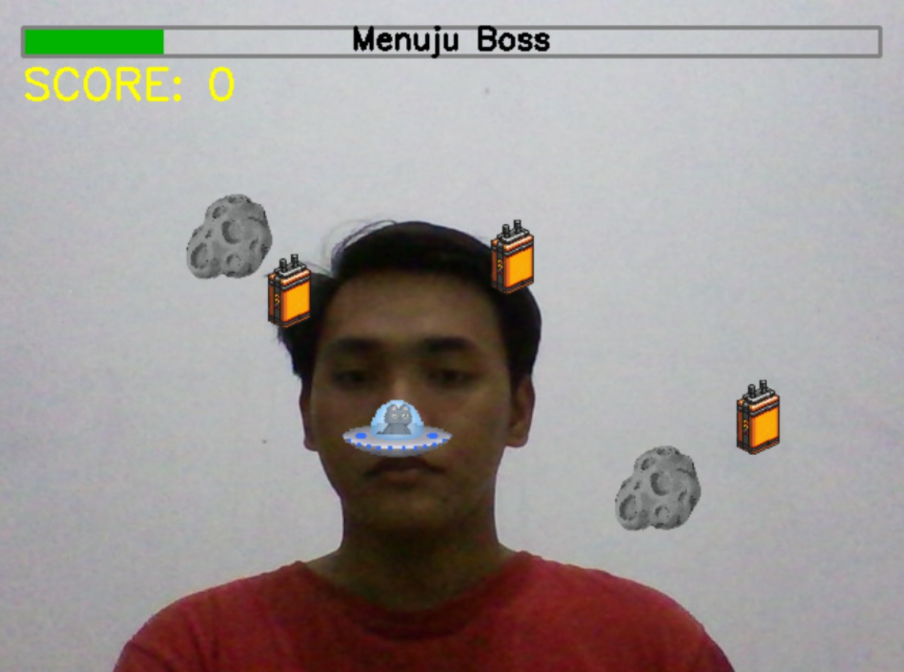
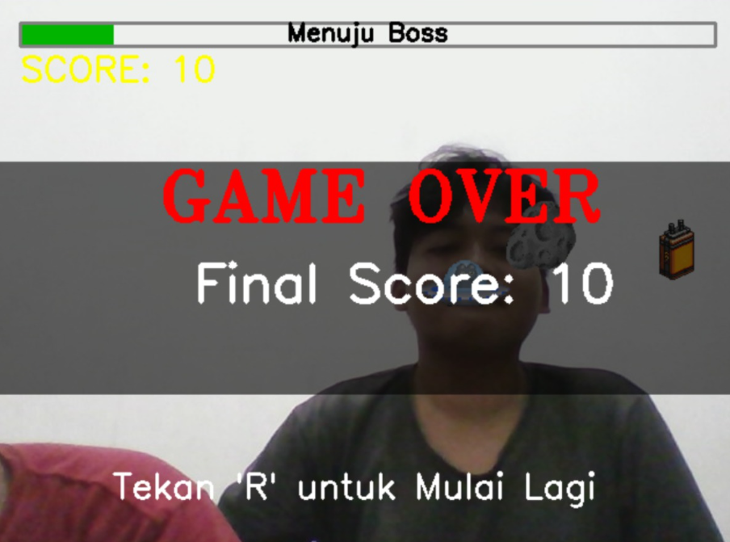
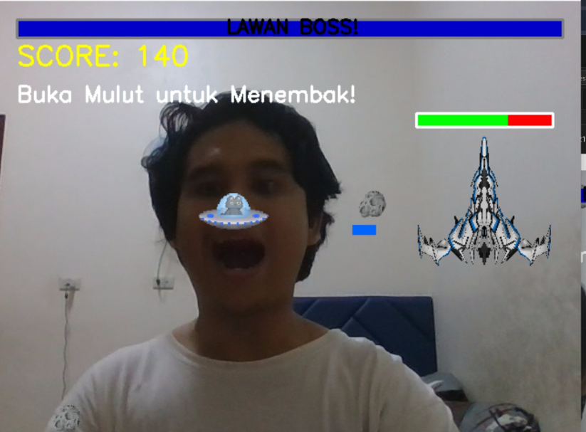

# 🚀 King-Astro

Repositori ini dibuat untuk memenuhi tugas besar mata kuliah **IF4021 - Teknologi Multimedia**  
**Dosen Pengampu:** Martin Clinton Tosima Manullang, Ph.D.  
**Nama Tim:** Pasukan King

### 👥 Anggota Tim

- Hagai Kopusi Sinulingga (122140059) – [GitHub](https://github.com/Hagaikopusi)  
- Muklis Mustaqim (122140115) – [GitHub](https://github.com/muklis-mustaqim-122140115)  
- Akhwan Adib Al-Hakim (122140149) – [GitHub](https://github.com/AkhwanAdib-122140149)

---

## 🎮 Deskripsi Proyek

**King-Astro: Game Filter Pesawat Luar Angkasa** adalah aplikasi interaktif berbasis *computer vision* yang mengintegrasikan teknologi **MediaPipe** untuk mendeteksi wajah dan titik landmark wajah secara real-time. Proyek ini dikategorikan sebagai *Aplikasi Komputer Visi Interaktif Real-Time*.  

Fitur utama:

- Deteksi keberadaan wajah untuk memulai permainan.
- Kontrol gerak pesawat menggunakan posisi hidung.
- Aksi menembak dilakukan dengan deteksi gerakan mulut terbuka.
- Semua pemrosesan dilakukan secara real-time, menyerupai pengalaman augmented reality (AR).

🎭 Referensi filter: [TikTok Filter](https://vt.tiktok.com/ZSrvPcXbe/)

---

## 🗓️ Logbook Mingguan

| Minggu | Tanggal       | Kegiatan                                          | Progres |
|--------|---------------|---------------------------------------------------|---------|
| 1      | 24 April 2025 | Pengajuan judul topik                             | ✅ 100% |
| 2      | 10 Mei 2025   | Pendaftaran repositori GitHub & pengumpulan topik | ✅ 100% |
| 3      | 15 Mei 2025   | Perencanaan awal kode program                     | ✅ 100% |
| 3      | 17 Mei 2025   | Pengumpulan aset visual                           | ✅ 100% |
| 3      | 20 Mei 2025   | Implementasi awal logika program                  | ✅ 100% |
| 4      | 21 Mei 2025   | Pembuatan kode program                            | ✅ 100% |
| 4      | 24 Mei 2025   | Revisi ide dan logika program                     | ✅ 100% |
| 4      | 27 Mei 2025   | Push code program ke GitHub                            | ✅ 100% |
| 4      | 27 Mei 2025   | Mulai penulisan laporan                           | ✅ 100% |
| 5     | 28 Mei 2025   | Penyempurnaan repositori GitHub                   | ✅ 100% |
| 5     | 30 Mei 2025   | Finalisasi laporan                                | ✅ 100% |
| 5     | 31 Mei 2025   | Pengumpulan Laporan ke Github                     |✅ 100% |
---

## 🛠️ Instruksi Instalasi dan Penggunaan

### 1. Instal Visual Studio Code (VSCode)

Unduh dan instal VSCode dari situs resmi: [https://code.visualstudio.com](https://code.visualstudio.com)  
VSCode akan digunakan untuk menulis, menjalankan, dan mengelola kode proyek King-Astro.

### 2. Unduh Proyek King-Astro

Clone atau unduh repositori ini melalui GitHub:  
[https://github.com/AkhwanAdib-122140149/King-Astro](https://github.com/AkhwanAdib-122140149/King-Astro)

> Setelah diunduh, buka folder proyek di VSCode melalui menu **File > Open Folder**.

### 3. Siapkan Virtual Environment (env)

Buka terminal di folder proyek dan jalankan:

```bash
python -m venv env
```

#### Aktifkan Environment:

**🔹 Windows:**
```bash
.\env\Scripts\activate
```
**🔹 MacOS/Linux:**
```bash
source env/bin/activate
```

### 4. Install Dependensi  
Pastikan virtual environment aktif, lalu instal pustaka berikut:
```bash
pip install -r requirements.txt
```

### 5. Jalankan Program  
✅ Pastikan semua dependensi telah terinstal dan environment aktif.
🚀 Jalankan program menggunakan terminal:  
```bash
python game.py
```
Atau buka file main.ipynb dan klik Run jika menggunakan Jupyter Notebook.  
---
### Dokumentasi dan Penjelasan Hasil Running Program
#### Awal Mulai
<p>
  
</p>

Pada bagian tengah layar, terlihat wajah pengguna yang berhasil terdeteksi oleh sistem. Hal
ini menunjukkan bahwa fitur pelacakan wajah (face tracking) dari pustaka MediaPipe sedang
aktif dan digunakan sebagai metode input utama dalam permainan. Sebuah gambar pesawat
(pesawat.png) ditampilkan tepat pada area hidung pengguna. Gambar ini berperan sebagai avatar
pemain di dalam game, yang pergerakannya mengikuti posisi hidung pengguna yang terdeteksi
secara real-time.

#### Terkena Rintangan
<p>
  
</p>

Teks "GAME OVER" berwarna merah yang ditampilkan besar di tengah layar. Tulisan ini secara langsung memberi tahu pemain bahwa permainan telah
dihentikan. Selain itu, terdapat lapisan gelap semi-transparan yang menutupi sebagian besar
area permainan. Efek visual ini membantu mengarahkan perhatian pemain pada status “Game
Over” dan membedakan antara kondisi permainan yang aktif dan permainan yang telah selesai.
Tampilan ini ditampilkan oleh sistem saat variabel self.game_over bernilai True, yang diproses
melalui metode _draw_ui.

#### Lawan Musuh/Bos  
<p>
  
</p>

Terlihat wajah pemain dengan kondisi mulut terbuka, yang menunjukkan bahwa pemain sedang mengaktifkan mekanisme menembak. Hal ini sesuai dengan petunjuk di layar, yaitu "Buka Mulut untuk Menembak!". Avatar pesawat (menggunakan aset pesawat.png) tetap berada di area wajah, khususnya sekitar hidung, sebagai penanda posisi pemain dalam permainan. Sebuah proyektil berwarna biru terlihat meluncur dari arah pesawat menuju ke arah musuh, yang menjadi bukti bahwa aksi menembak sedang berlangsung.

## Link Video Demonstrasi
### [Link Google Drive](https://drive.google.com/drive/folders/1A0DDqJLNo2VBRvt1WeJqb8qXd8m5Ju2A?usp=sharing)
## 🙏 Terima Kasih  
### Selamat mencoba dan semoga menyenangkan dalam memainkan game interaktif King-Astro! 🚀

